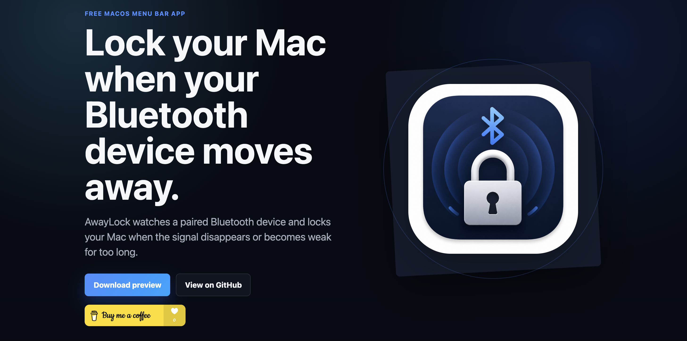

# AwayLock

AwayLock is a native macOS menu bar app that watches a selected Bluetooth LE device and locks the Mac when the device is missing or has a weak averaged RSSI signal for longer than the configured timeout.



AwayLock is free. If you find it useful, the app includes an optional Buy Me a Coffee link for supporting development.

> Preview status: AwayLock is currently an unsigned preview build. Public notarized distribution requires an Apple Developer Program membership.

## Features

- Menu bar-only app using AppKit and SwiftUI.
- CoreBluetooth scanning filtered to paired or known Bluetooth device names.
- Stored selected device in `UserDefaults`.
- RSSI moving average with configurable window.
- Missing-device and weak-signal lock timeouts.
- Pause, enable/disable, cooldown, notifications, and settings.
- Modern light/dark/system appearance setting.
- Launch at Login wiring through `SMAppService.mainApp`.

## Download

For now, download preview builds from GitHub Releases.

Because preview builds are not notarized yet, macOS may block opening the app the first time. Use right-click > Open, then confirm that you want to open it.

## Website

The GitHub Pages landing page lives in `docs/` and is published at `https://rehacekleos.github.io/away-lock/`.

## Run From Source

```sh
swift run AwayLock
```

## Build Locally

```sh
./scripts/build_app.sh
open dist/AwayLock.app
```

By default, local builds are ad-hoc signed. Release packaging and notarization notes are in [RELEASING.md](RELEASING.md).

AwayLock locks the current macOS session directly. It sends the macOS lock shortcut from the app and falls back to system commands when available; it does not use display sleep. Grant AwayLock Accessibility permission in System Settings > Privacy & Security > Accessibility if Lock Now logs that permission is required. If macOS asks whether AwayLock can control System Events, allow it.

## Bluetooth Note

CoreBluetooth scans Bluetooth LE advertisements and the picker shows only scanned BLE devices whose name exactly matches a device macOS reports as paired or known. Pair or trust the phone, watch, headphones, or other target in macOS Bluetooth settings first, then refresh. BLE names can be reused, so verify the UUID shown in AwayLock before selecting a proximity device. Classic Bluetooth devices may not appear unless they advertise over BLE.

## Privacy

AwayLock scans local Bluetooth LE advertisements on your Mac. It does not upload device names, identifiers, RSSI values, or settings to any server. See [PRIVACY.md](PRIVACY.md).

## Project Documents

- [CHANGELOG.md](CHANGELOG.md)
- [SECURITY.md](SECURITY.md)
- [LICENSE](LICENSE)

## Support

AwayLock is free. Optional support: https://buymeacoffee.com/leosrehacek
